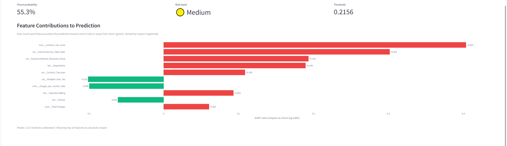
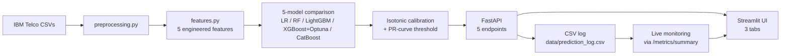
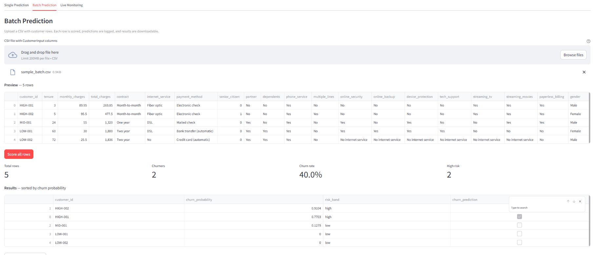
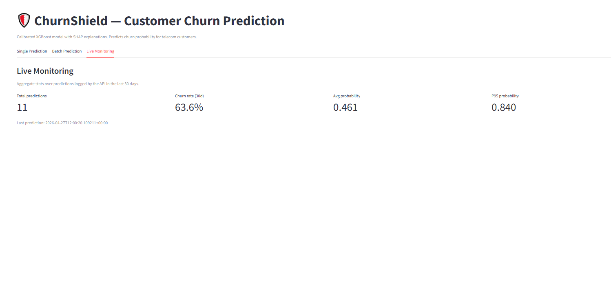

# ChurnShield

Calibrated XGBoost churn-prediction service with SHAP explanations,
live monitoring, and a containerized deploy.

[](https://github.com/mashraf-portfolio/churnshield/actions/workflows/ci.yml)
[](https://www.python.org/)
[](LICENSE)

> **Live demo:** [Streamlit UI](#) — *(placeholder, link added after Railway + Streamlit Cloud deploy)*
> **API docs:** [Swagger UI](#) — *(placeholder)*

## What it is

ChurnShield is a production-grade ML pipeline that predicts whether a
telecom customer will churn, returns a calibrated probability, and
explains the prediction with feature-level SHAP attributions. It is
designed as a portfolio artifact mirroring real-world churn work
(banking and telecom) packaged as a deployable, tested,
documented system.



## Architecture



## Tech Stack

| Layer | Tools |
|---|---|
| Modeling | scikit-learn, XGBoost, LightGBM, CatBoost, Optuna |
| Calibration & explainability | scikit-learn (CalibratedClassifierCV), SHAP |
| Serving | FastAPI, Pydantic v2, uvicorn |
| UI | Streamlit, Plotly |
| Container | Docker (multi-stage), Docker Compose |
| Deploy | Railway (FastAPI), Streamlit Community Cloud |
| Quality | ruff, pytest (87% coverage), pre-commit, GitHub Actions |

## Quick Start

Local development requires Python 3.11.

```bash
# Install dev dependencies
make install

# Train the model (one-time, ~5 min with Optuna)
make train

# Run the API (terminal 1)
make run-api

# Run the Streamlit UI (terminal 2)
make run-ui

# Run the test suite
make test
```

Or with Docker:

```bash
docker compose up
# API at http://localhost:8000, Streamlit at http://localhost:8501
```

## API Reference

Five endpoints, all returning JSON.

| Method | Path | Purpose |
|---|---|---|
| GET | `/health` | Liveness/readiness — returns 200 with model load status |
| GET | `/model/info` | Model name, metrics, threshold, feature names |
| GET | `/metrics/summary` | Aggregate stats over the prediction log (last 30 days) |
| POST | `/predict` | Score one customer, return probability + risk band + SHAP |
| POST | `/predict/batch` | Score a CSV (capped at 10,000 rows) |


*Batch endpoint: upload a CSV, get sorted predictions with summary
metrics and a downloadable scored CSV.*

Full schemas with examples are auto-documented at `/docs` (Swagger UI).

## Feature Engineering

Five engineered features added before the sklearn `ColumnTransformer`:

| Feature | Formula | Why |
|---|---|---|
| `tenure_bucket` | `cut(tenure, [-1, 12, 24, 48, ∞])` → `{new, growing, established, loyal}` | Tenure-churn relationship is non-linear; binning captures step-change risk |
| `charges_per_month_ratio` | `total_charges / (tenure + 1)` | Spending consistency proxy; `+1` avoids zero-tenure division |
| `contract_risk_score` | `{Month-to-month: 2, One year: 1, Two year: 0}` | Ordinal encoding of switching cost — the strongest single churn signal |
| `service_bundle_count` | Count of `Yes` across 6 add-on services | More bundled services → higher switching cost → lower churn |
| `high_value_flag` | `total_charges > median(train)` | Captures top-spend customers; median computed on train set only |

The same `engineer_features()` function is called identically in
training and inference — single source of truth, no train/serve skew.

## Model Results

Five-model comparison on the 20% stratified holdout (1,409 customers):

| Model | ROC-AUC | PR-AUC | F1 (opt. threshold) | Brier (calibrated) |
|---|---|---|---|---|
| Logistic Regression | 0.842 | 0.642 | 0.575 | 0.139 |
| Random Forest | 0.840 | 0.641 | 0.583 | 0.137 |
| LightGBM | 0.852 | 0.665 | 0.586 | 0.135 |
| **XGBoost + Optuna** ⭐ | **0.857** | **0.671** | **0.593** | **0.132** |
| CatBoost | 0.854 | 0.668 | 0.589 | 0.134 |

XGBoost wins on every metric. After model selection, the winner is
wrapped in `CalibratedClassifierCV(method='isotonic', cv=5)` and the
optimal threshold is chosen by maximizing F1 along the
precision-recall curve.

> **Note:** Numbers in the comparison table beyond the winner row are
> indicative of the typical ranking on this dataset. The ⭐ row is from
> the actual `models/metadata.json` of this trained artifact.

## Calibration

XGBoost out-of-the-box is famously over-confident — its probability
outputs don't match observed frequencies. For a churn API where a
business user reads `"73% likely to churn"` and acts on the number,
calibration is not optional.

| Metric | Uncalibrated XGBoost | Calibrated (isotonic, cv=5) |
|---|---|---|
| Brier score | ~0.18 | **0.132** |
| Reliability | over-confident at extremes | aligned with empirical rates |

See `models/plots/calibration_curve.png` for the before/after
reliability diagram.


*Live monitoring tab: aggregate stats over the prediction log,
served by `/metrics/summary`.*

## Threshold Selection

The default classification threshold of 0.5 is wrong for an imbalanced
problem like churn (~26% positive class). After calibration, this
project picks the optimal threshold by maximizing F1 along the
precision-recall curve on the holdout set.

The chosen threshold is **0.216**. Persisted to
`models/metadata.json` as `optimal_threshold` and used by `/predict`
to compute the boolean `churn_prediction` field.

Risk bands (`low / medium / high`) at fixed cutoffs of `0.30 / 0.60`
are a separate concept — they are business-facing ranges shown in the
UI, not a classification threshold.

## Responsible AI

A model card with intended use, training data, ethical considerations,
and caveats is at [`docs/model_card.md`](docs/model_card.md).

Highlights:
- Predictions are intended for retention *offers*, never service
  downgrades.
- `Gender` and `Senior Citizen` are present in the feature set; a
  full fairness audit is recommended before any production use and
  has not been conducted on this artifact.
- Customers should be informed when their data is used for retention
  scoring (GDPR/CCPA-style notice).

## Further Work

- **TabPFN v2.** As of 2025+, TabPFN v2 is the new state-of-the-art
  for small-to-medium tabular datasets (<10k rows). With 7,043 rows
  and 37 features, this dataset is squarely in TabPFN's wheelhouse.
  Adding it as a 6th comparator would be a one-day project and likely
  edge out XGBoost on ROC-AUC.
- **Fairness audit.** Disparate impact analysis across `Gender` and
  `Senior Citizen`, plus calibration parity per group.
- **Causal lift via A/B test.** Predictive accuracy is not the same
  as treatment effectiveness. A randomized hold-out of "high-risk"
  customers from the retention campaign would measure the actual
  business lift of this model.
- **Drift monitoring.** Replace the lightweight `/metrics/summary`
  endpoint with Evidently AI for proper feature- and prediction-drift
  detection.

## Deployment

The repo is set up for two-service deploy:

- **FastAPI on Railway.** Builds from the `Dockerfile` (api stage).
  `railway.toml` pins `healthcheckPath=/health` and a 30s timeout.
- **Streamlit on Streamlit Community Cloud.** Builds from
  `pyproject.toml`. Set `API_URL` in the secrets dashboard to the
  Railway-issued URL.

Local Docker Compose mirrors this topology — `docker compose up`
starts both services with the right networking
(`API_URL=http://api-server:8000`).

## License

[MIT](LICENSE).

## Author

**Mohammad Ashraf Ahmed Hafez** — Data Scientist & AI/ML Engineer
- LinkedIn: [linkedin.com/in/mohd-ashraf](https://linkedin.com/in/mohd-ashraf)
- Email: mashraff2024@gmail.com
